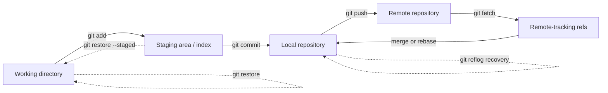

# Git Command Master Map

[](https://github.com/jeevanm84/git-command-master-map/actions/workflows/ci.yml)
[](https://jeevanm84.github.io/git-command-master-map/)
[](LICENSE)

A safety-first Git learning system that connects commands to Git's data model, then proves the concepts through isolated branching, conflict, recovery, debugging, and collaboration labs.

> Every destructive exercise runs inside a newly created temporary repository. The labs never modify one of your existing projects.

## Start with the visual map

Open the [interactive Git Command Master Map](https://jeevanm84.github.io/git-command-master-map/) for a compact reference covering setup, staging, commits, branches, remotes, undo, rebase, recovery, debugging, and daily DevOps workflows.

The map is the memory aid. The repository is the practice environment.

## Understand where Git commands act



Most Git mistakes become manageable once you identify which location changed and whether the affected object is still reachable.

## Learning paths

| Level | Modules | Outcome |
|---|---|---|
| Beginner | 1–3 | Create repositories, inspect changes, stage, commit, branch, merge, and resolve a conflict |
| Intermediate | 4–5 | Rebase, cherry-pick, stash, undo safely, and recover deleted-looking work |
| Advanced | 6–7 | Diagnose regressions with bisect, investigate history, and operate a review-based team workflow |
| Production | Troubleshooting and scenarios | Choose safe recovery techniques for shared branches and incident conditions |

Follow the [End-to-End Guide](docs/END_TO_END_GUIDE.md) the first time.

## Five-minute safe start

Prerequisites: Git, Bash, and Python 3.

```bash
git clone https://github.com/jeevanm84/git-command-master-map.git
cd git-command-master-map
./scripts/check.sh
./scripts/new-sandbox.sh
```

The second command prints the location of a disposable Git repository configured with a local-only practice identity.

## Hands-on labs

| Lab | Focus | Format |
|---:|---|---|
| 01 | Repository model and inspection | Guided |
| 02 | Branching and merging | Guided + executable setup |
| 03 | Conflict investigation and resolution | Guided + executable setup |
| 04 | Rebase and cherry-pick | Guided |
| 05 | Undo and reflog recovery | Executable demonstration |
| 06 | Regression debugging with bisect | Executable demonstration |
| 07 | Pull-request and release workflow | Scenario-based |

Each lab specifies its objective, starting state, observations, verification, recovery, explanation, and extensions.

## Repository map

```text
git-command-master-map/
├── README.md
├── docs/
│   ├── index.html                 # Visual master map / GitHub Pages
│   ├── END_TO_END_GUIDE.md        # Single start-to-finish path
│   ├── GIT_DATA_MODEL.md          # Objects, refs, index and remotes
│   ├── TROUBLESHOOTING.md         # Symptom-to-recovery handbook
│   └── INTERVIEW_QUESTIONS.md     # Fundamentals through senior scenarios
├── labs/                          # Seven isolated practical modules
├── scripts/
│   ├── new-sandbox.sh             # Safe disposable repository factory
│   ├── check.py                   # Documentation and identity validation
│   └── check.sh                   # Complete local quality gate
├── tests/                         # Executable behavior tests
└── .github/                       # CI and community configuration
```

## Safety model

- Practice identity is local to each sandbox and uses `learner@example.invalid`.
- Lab scripts reject cleanup targets that do not match their `mktemp` prefix.
- `git reset --hard`, branch deletion, and reflog recovery are demonstrated only in disposable repositories.
- Shared-branch guidance prefers `git revert` over history rewriting.
- Force-push examples use `--force-with-lease`; plain `--force` is treated as an unsafe default.
- No GitHub token, remote push, or network connection is required for the labs.

## Production reasoning

The project explains more than command syntax:

- When merge preserves useful topology and when rebase improves local history
- Why a commit can be recoverable after a reset
- Why remote-tracking branches are not live remote branches
- How to distinguish working-tree, index, and commit problems
- Why protected branches and review workflows matter
- How to investigate before rewriting or deleting history

## Documentation

- [End-to-End Guide](docs/END_TO_END_GUIDE.md)
- [Git Data Model](docs/GIT_DATA_MODEL.md)
- [Troubleshooting Handbook](docs/TROUBLESHOOTING.md)
- [Interview Questions](docs/INTERVIEW_QUESTIONS.md)
- [Visual Master Map](https://jeevanm84.github.io/git-command-master-map/)

## Portfolio position

```text
Git foundations  →  AWS  →  Terraform  →  Packer  →  Kubernetes
```

Continue with [Terraform AWS High-Availability Web Platform](https://github.com/jeevanm84/terraform-aws-ha-web-platform), or return to the [jeevanm84 engineering portfolio](https://github.com/jeevanm84).

## Contributing and security

Contributions are welcome through pull requests. Read [CONTRIBUTING.md](CONTRIBUTING.md) and report vulnerabilities privately using [SECURITY.md](SECURITY.md). Never include real credentials, private repository URLs, employer information, or sensitive commit history in an issue.

Maintained by [@jeevanm84](https://github.com/jeevanm84) · [MIT License](LICENSE)
