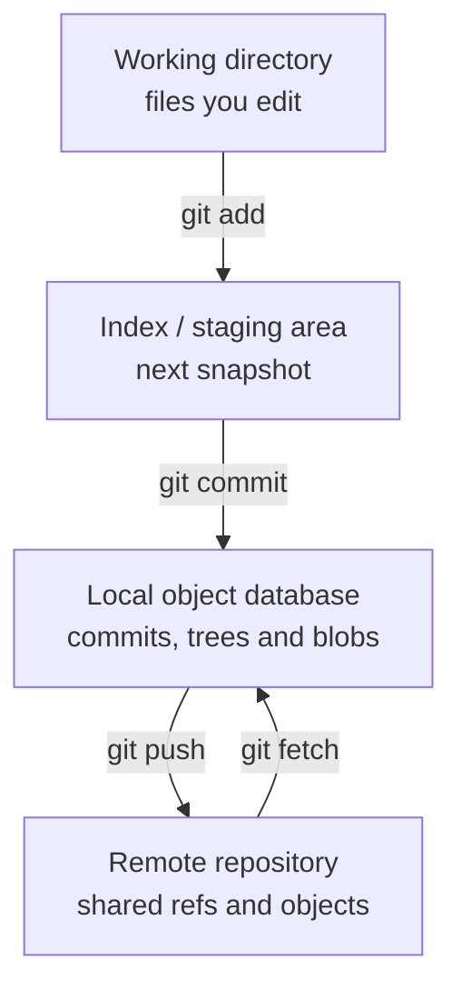
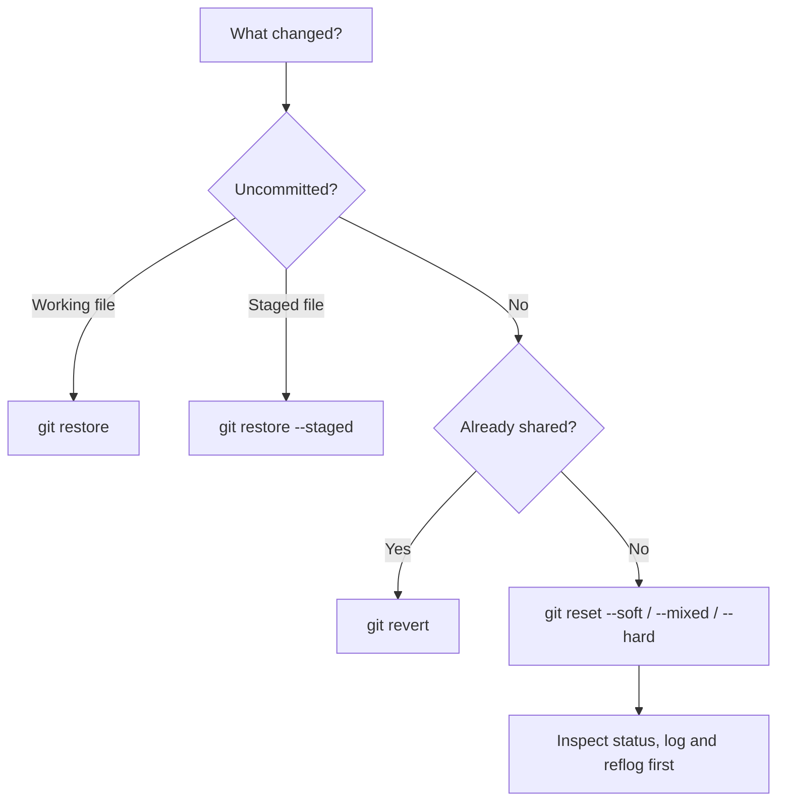

# Git data model

Commands are easier to select when you understand the state they read or change.

## Four working locations



`git status` compares the working directory, index, and current commit. `git diff` compares working files with the index; `git diff --staged` compares the index with `HEAD`.

## Core objects

| Object | Meaning | Important property |
|---|---|---|
| Blob | File content | Does not contain a filename |
| Tree | Directory snapshot | Maps names to blobs and other trees |
| Commit | Snapshot plus metadata | Points to a tree and parent commit(s) |
| Tag | Named release object | Annotated tags can contain identity and message data |

A branch is a movable reference to a commit. `HEAD` normally points to the currently checked-out branch; in detached HEAD state it points directly to a commit.

## Reachability and recovery

Deleting a branch or moving it with `reset` usually changes a reference—it does not immediately erase the commit object. The reflog records recent local reference movements, which is why recovery is often possible:

```bash
git reflog
git branch recovered-work <commit>
```

Reflogs are local and expire. They are a recovery mechanism, not a backup policy.

## Local and remote-tracking branches

```text
main                 local branch
origin/main          local record of the last fetched remote main
remote main          branch stored by the remote repository
```

`git fetch` updates `origin/main`. It does not automatically change local `main` or the working directory. `git pull` performs a fetch followed by integration according to the configured strategy.

## Merge, rebase and cherry-pick

| Operation | Result | Appropriate use |
|---|---|---|
| Merge | Combines histories, sometimes with a two-parent commit | Preserve branch topology or integrate a shared branch |
| Rebase | Recreates commits on a new base | Clean up unpublished local work |
| Cherry-pick | Recreates selected commit changes | Targeted backport or isolated fix |

Rebase and cherry-pick create new commit identities even when the resulting file changes are similar.

## Undo decision



The safest command is the one whose scope matches the actual problem.
