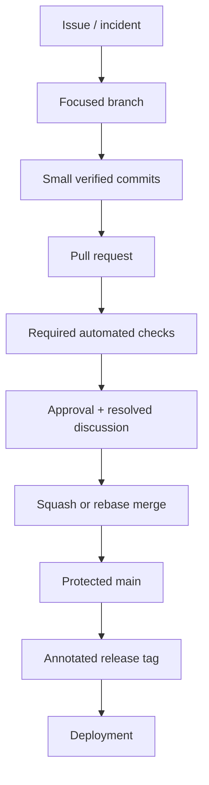

# Lab 07 — protected team workflow

## Scenario

A team deploys from `main`. Direct pushes and force-pushes must not bypass review or CI, but urgent production fixes still need a controlled path.

## Design the workflow

## Required controls

- Pull request required for `main`
- At least one approval
- Stale approvals dismissed after material changes
- Required conversations resolved
- Required status checks on the latest commit
- Linear history when the team selects squash/rebase merges
- Branch deletion and force-push disabled
- CODEOWNERS for sensitive paths
- Signed releases or provenance where required

## Hotfix exercise

Design a hotfix for a production regression:

1. Create a focused branch from current `main`.
2. Reproduce the failure with an automated test.
3. Implement the smallest mitigation.
4. Pass the same required CI and review path.
5. Merge and tag the release.
6. Backport only when another maintained release line requires it.
7. Write the permanent-fix and prevention work separately.

## Review questions

- Can the author merge their own unreviewed change?
- What prevents CI from passing on an older commit while a newer commit is merged?
- When is squash preferable to preserving individual commits?
- How are generated files, secrets, and workflow changes reviewed?
- How is a production release traced back to code, review, and build evidence?
